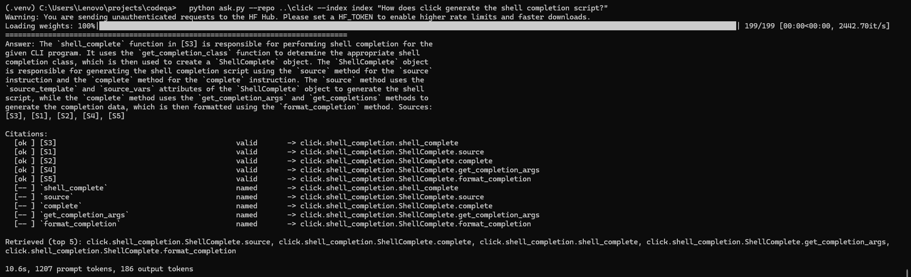

# codeqa: code-aware retrieval for repository Q&A

[](https://github.com/Divjotflora/codeqa/actions/workflows/tests.yml)

Given a question about a Python codebase, such as a bug report, "where is X handled?" or
"what breaks if I change Y?", find the functions that answer it.

The system combines tree-sitter AST chunking, a call graph resolved with Jedi, and
hybrid BM25 + dense retrieval with graph expansion. It is evaluated on **210 real
GitHub issues from two repositories**, with gold answers mined from the PRs that
closed them.



## Headline result

Pooled over click and Jinja issues (n = 210), compared with the usual RAG baseline of
BM25 over fixed-size text chunks:

| | fixed-window BM25 | **codeqa** | gain | 95% CI (paired bootstrap) |
|---|---|---|---|---|
| function recall@5 | 0.290 | **0.491** | +0.202 | [+0.142, +0.263] |
| function recall@10 | 0.384 | **0.605** | +0.221 | [+0.160, +0.285] |
| function hit@10 | 0.495 | **0.733** | +0.238 | [+0.171, +0.305] |
| function MRR | 0.313 | **0.520** | +0.207 | [+0.154, +0.261] |

All four p < 0.001. Everything runs locally on a laptop CPU, with no paid APIs.

---

## How it works

```
repo ──tree-sitter──▶ chunks ──────────────┬─▶ BM25 (identifier-aware) ─┐
  │                  (functions, methods,  │                            ├─▶ RRF ─▶ graph expansion ─▶ ranked functions
  │                   class skeletons)     └─▶ dense (bge-small) ───────┘           ▲
  └──Jedi──▶ code graph (calls, inherits, imports, tested_by) ─────────────────────┘
```

**Chunking** (`codeqa/chunker.py`)
- One chunk per function or method.
- Classes become *skeletons*: header, docstring, attributes and method signatures, so
  method bodies are never indexed twice.
- Modules become an import list plus an index of the names they define.
- Functions longer than 80 lines are split at statement boundaries, and every part
  repeats the signature.
- `@overload` stubs are dropped.

**Code graph** (`codeqa/graph.py`)
- Edges: `calls`, `inherits`, `imports`, `contains`, `tested_by`.
- Call targets are resolved with Jedi's static inference, so `self.save()` lands on the
  right class instead of every function named `save`.
- When Jedi can't resolve a call, it falls back to the name only if exactly one symbol
  in the repo has it.
- On click, **77% of calls into the repo's own code resolve** (3,290 of 4,262).
- `impact(symbol)` walks callers and subclasses, then collects the tests that exercise
  them.

**Retrieval** (`codeqa/retrievers.py`, `codeqa/embed.py`, `codeqa/fusion.py`)
- **BM25 with identifier-aware tokenization.** `get_terminal_size` is indexed as the
  full name and as `terminal` and `size`, so prose queries match code.
- **Dense retrieval** with `bge-small`. Vectors are cached by a hash of the embedded
  text, so re-indexing only embeds what changed.
- **Reciprocal rank fusion** (RRF) combines the rankings, so scores from different
  retrievers never need calibrating against each other.
- **Graph expansion.** Neighbours of the top 10 results score `alpha / seed_rank`
  (alpha = 0.5), summed across seeds and capped at 8 per seed. Functions connected to
  several hits rise, and a function with 60 callers can't flood the list.

---

## Evaluation

### Eval sets: mined from real PRs (`codeqa/evalset.py`)

For each merged PR:
1. Diff it against its first parent.
2. Map the changed lines in non-test files to the innermost function or class *at the
   base commit*. Those are the gold answers.
3. Use the **text of the issue the PR closes** as the query. This is the realistic
   setting: a user describing a symptom.

Skipped automatically:
- housekeeping, docs and typo PRs
- PRs touching more than 4 files or more than 8 symbols
- PRs whose changes are all at module level

Each question is tagged **explicit** (the query names a gold function, often in a
traceback) or **implicit** (it doesn't).

| set | role | questions evaluated | explicit / implicit |
|---|---|---|---|
| click, PR titles | **dev**: every design decision was made here | 259 | 81 / 178 |
| click, issues | test | 147 | 80 / 67 |
| Jinja, issues | **held-out test**: a second repo, nothing tuned on it | 63 | 22 / 41 |
| Werkzeug, issues | dev set for the reranker follow-up only (issue-style queries) | 100 | 49 / 51 |

Metrics:
- **recall@k**: share of gold functions in the top k.
- **hit@k**: share of questions with at least one gold function in the top k.
- **MRR**: mean of 1 / rank of the first gold function.

All are reported at function level and module level.

### Protocol

1. All design choices were made on the click title set: chunking, graph settings, and
   whether to use summaries.
2. The final configuration (hybrid + graph) was then fixed **before** Jinja was mined.
3. Jinja is the clean confirmation.

One caveat, stated plainly: on the dev set, hybrid + graph and BM25 + graph were tied.
I picked hybrid + graph having also seen the click issue results, so click issues are
not fully clean for *that one* choice. Jinja is.

### Results

#### Click issues (n = 147)

| retriever | recall@5 | recall@10 | hit@10 | MRR | implicit recall@10 (n=67) |
|---|---|---|---|---|---|
| BM25, fixed 50-line windows | 0.289 | 0.402 | 0.524 | 0.318 | 0.285 |
| BM25, AST chunks | 0.457 | 0.555 | 0.708 | 0.428 | 0.361 |
| BM25, AST + graph | 0.462 | 0.594 | 0.728 | 0.480 | 0.369 |
| dense (bge-small) | 0.426 | 0.510 | 0.667 | 0.423 | 0.333 |
| hybrid (BM25 + dense, RRF) | 0.504 | 0.592 | 0.735 | 0.489 | 0.433 |
| **hybrid + graph** | **0.513** | **0.645** | **0.769** | **0.543** | **0.478** |

#### Jinja issues: held-out repo (n = 63)

| retriever | recall@5 | recall@10 | hit@10 | MRR | implicit recall@10 (n=41) |
|---|---|---|---|---|---|
| BM25, fixed 50-line windows | 0.291 | 0.342 | 0.429 | 0.301 | 0.243 |
| BM25, AST chunks | 0.377 | 0.464 | 0.571 | 0.345 | 0.304 |
| BM25, AST + graph | 0.350 | 0.436 | 0.540 | 0.332 | 0.284 |
| dense (bge-small) | 0.404 | 0.463 | 0.603 | 0.415 | 0.354 |
| hybrid (BM25 + dense, RRF) | 0.416 | 0.501 | **0.667** | 0.460 | 0.360 |
| **hybrid + graph** | **0.441** | **0.512** | 0.651 | **0.466** | **0.393** |

#### What each component contributes (pooled, n = 210, paired bootstrap, 10k resamples)

| comparison | recall@5 | recall@10 | hit@10 | MRR |
|---|---|---|---|---|
| full system vs fixed-window BM25 | +0.202 *** | +0.221 *** | +0.238 *** | +0.207 *** |
| full system vs BM25 over AST chunks | +0.058 * | +0.078 ** | +0.067 * | +0.117 *** |
| graph's contribution (hybrid + graph vs hybrid) | +0.014 (n.s.) | +0.040 * | +0.019 (n.s.) | +0.040 ** |

\* p < 0.05, \*\* p < 0.01, \*\*\* p < 0.001. Twelve tests were run. With a Bonferroni
correction (p < 0.004), everything above survives **except** the graph's recall@10 and
the full-vs-AST recall@5 and hit@10.

### Findings

1. **AST chunking is the biggest single win, and it generalizes.** Fixed windows to AST
   chunks: recall@10 0.40 → 0.56 on click and 0.34 → 0.46 on Jinja. Issue text often
   contains tracebacks and snippets, which match function-sized chunks far better than
   arbitrary 50-line windows.

2. **Dense retrieval complements BM25 rather than replacing it.** Alone, bge-small is
   roughly level with BM25. Fused, the two beat either one, because they find different
   answers. Dense retrieval matters most on implicit questions: on Jinja, it beats BM25
   alone (implicit recall@10 0.354 vs 0.304).

3. **Graph expansion improves ranking, not coverage.** Across both repos it lifts MRR by
   +0.040 (CI [+0.014, +0.067]), but it doesn't significantly change how many questions
   get a correct answer in the top 10. It promotes the right function when the
   retriever already found something next to it.
   - On click, callers were the most useful edge type. On the dev set, callers alone
     gave recall@5 +0.028, and callees alone gave recall@20 +0.049.
   - The 9 settings swept on dev (3, 5 or 10 seeds × alpha 0.2, 0.35 or 0.5) all beat
     plain BM25, so the gain isn't a tuning artifact.

4. **The graph is repo-dependent.** On Jinja, graph expansion on top of BM25 *hurt*
   (recall@10 0.464 → 0.436), while on click it helped. Two likely causes, identified
   after the fact and deliberately not tuned on:
   - Jinja's compiler dispatches `visit_*` methods dynamically through `getattr`, which
     static resolution can't follow.
   - When a large class ranks highly, up to 8 of its methods are pulled in. For a class
     with around 100 methods, those with no other evidence are chosen alphabetically,
     which is essentially arbitrary.

### Negative result: LLM-generated summaries

Each function, method and class was summarized in plain English by a local model
(`qwen2.5-coder:1.5b` via Ollama): 1,370 summaries in 28 minutes on a laptop CPU, at
no cost. The idea was to bridge the vocabulary gap on implicit questions, where an
issue says "pager swallows my flags" and the code says `_pipepager`.

On the dev set (n = 259), summaries **lost**:

| retriever | recall@10 | MRR |
|---|---|---|
| BM25 over code | 0.499 | 0.356 |
| BM25 over code + summaries | 0.495 | 0.358 |
| dense over code | 0.452 | 0.310 |
| dense over summaries | 0.385 | 0.256 |
| hybrid without summaries, + graph | **0.589** | **0.427** |
| 3-way hybrid with summaries, + graph | 0.567 | 0.386 |

Why:
- The small model writes nearly every summary the same way ("This function is
  responsible for…"), so summary embeddings sit close together and separate functions
  poorly.
- Under RRF, a weak retriever gets an equal vote and drags the fusion down.

Summaries were therefore excluded from the final system, a decision made on dev alone.

Writing the summaries also exposed a prompting problem.
- The first prompt asked for "notable edge cases". The 1.5B model invented them (for
  example, error handling that doesn't exist) and wrote fictional purposes for module
  chunks, which contain only imports.
- Prompt v2 caps answers at 60 words, forbids describing behaviour that isn't in the
  code, and skips modules. That fixed most of it.

A stronger summarizer may change this result. It's on the roadmap.

### Negative result: cross-encoder reranking

A cross-encoder (`cross-encoder/ms-marco-MiniLM-L-6-v2`) rescored the top 50 results of
hybrid + graph (`codeqa/rerank.py`). It reads query and code *together*, which is more
accurate than comparing separate embeddings but too slow to run over a whole repo. Two
modes were tried:
- **ce**: rank purely by the cross-encoder.
- **rrf**: blend the cross-encoder's ranking with the original one, as a safety net,
  because the model was trained on web search queries, not code.

**On dev it won, significantly.** Click PR titles, n = 259:

| | recall@5 | recall@10 | MRR |
|---|---|---|---|
| hybrid + graph | 0.427 | 0.589 | 0.427 |
| + rerank, pure (ce) | 0.454 | 0.554 | 0.419 |
| + rerank, blended (rrf) | **0.497** | **0.603** | **0.465** |

Blended vs hybrid + graph: recall@5 +0.070 (CI [+0.028, +0.113], p = 0.001) and MRR
+0.037 (p = 0.005). Recall@10 didn't change, as expected for something that only
reorders the top 50.

**The prediction was written down before testing:** recall@5 and MRR would improve on
the issue sets.

**On test it failed.** Pooled click + Jinja issues, n = 210:

| | recall@5 | recall@10 | MRR |
|---|---|---|---|
| hybrid + graph | **0.491** | **0.605** | **0.520** |
| + rerank, pure (ce) | 0.356 | 0.495 | 0.382 |
| + rerank, blended (rrf) | 0.479 | 0.593 | 0.497 |

Blended vs hybrid + graph: MRR −0.023 (CI [−0.052, +0.005]); no metric was significant.
The cost was 2.6 s per query on a laptop CPU. **The reranker is not part of the final
system.**

**Why dev and test disagreed: the query distributions differ.**
- Dev queries are PR titles, about 10 words, close to the short web queries MiniLM was
  trained on.
- Test queries are issue bodies, often several paragraphs with tracebacks.
- A cross-encoder reads query and code within a single 512-token window. A long issue
  fills most of it, and the traceback that names the function is what gets cut off.
- Consistent with that, on click the blended reranker *hurt* explicit questions (MRR
  0.789 → 0.736) and helped implicit ones slightly (hit@10 0.582 → 0.627).

**Lesson:** a dev set must match the test query distribution for components that are
sensitive to query form. PR titles were an adequate dev set for chunking and graph
decisions, and the wrong one for a cross-encoder.

**Follow-up: condensed queries, selected on an issue-style dev set.** To test the
truncation explanation without touching the test sets, a third repo, pallets/werkzeug,
was mined as an *issue-style* dev set: 160 issues, 100 still answerable at HEAD.

The cross-encoder was given three different views of each query (`--rerank-query`):
- **full**: the whole issue, the original setting.
- **title**: the issue title only.
- **title+ids**: the title plus identifiers pulled from the body (traceback frames,
  backticked names, dotted and snake_case tokens).

The rule, fixed in advance: adopt a variant only if it beats hybrid + graph on MRR, and
the gain is significant.

| Werkzeug dev, n = 100 | recall@5 | recall@10 | hit@10 | MRR |
|---|---|---|---|---|
| hybrid + graph | 0.577 | 0.665 | 0.780 | **0.558** |
| + rerank, full query: pure / blended | 0.390 / 0.552 | 0.550 / 0.653 | 0.710 / 0.790 | 0.382 / 0.503 |
| + rerank, title: pure / blended | 0.470 / **0.594** | 0.594 / **0.680** | 0.740 / **0.810** | 0.438 / 0.535 |
| + rerank, title+ids: pure / blended | 0.437 / 0.571 | 0.608 / 0.652 | 0.740 / 0.780 | 0.434 / 0.537 |

- **Werkzeug reproduces the test-set failure** with full queries (blended MRR −0.055),
  so it is a valid dev set for this question.
- **The truncation explanation was half right.** Condensing to the title lifted the
  pure reranker substantially (recall@5 0.390 → 0.470, MRR 0.382 → 0.438). The extra
  identifiers didn't help further.
- **No variant beats the baseline's MRR**, so by the pre-set rule none was adopted, and
  none was run on the click and Jinja test sets.

The remaining gap is the model itself. A cross-encoder trained on web search (MS MARCO)
doesn't judge code relevance well enough to improve on BM25 + dense + graph. The next
attempts are a code-trained reranker, or fine-tuning one on mined (issue, function)
pairs from other repos (see the roadmap).

### Negative result: code-specific embedding models

Retrieval is the bottleneck on implicit questions, so code-trained embedding models were
tried as replacements for bge-small. They were selected on the issue-style Werkzeug dev
set, with the same rule as before: adopt a model only if it beats bge-small on
hybrid + graph MRR.

| Werkzeug dev, n = 100 | dense recall@10 | dense recall@10 (implicit) | hybrid + graph MRR |
|---|---|---|---|
| **bge-small** (general text, 33M) | **0.536** | **0.381** | **0.558** |
| st-codesearch-distilroberta (code search, 82M) | 0.391 | 0.189 | 0.467 |

What happened to each candidate:
- **The code-search model is clearly worse,** and only half as good on implicit
  questions. It was trained on CodeSearchNet, where every "query" is a function's own
  docstring: short, clean, and written by the code's author. The queries here are bug
  reports written by users. This is the same lesson as the reranker: being trained on
  *code* matters less than being trained on queries like yours.
- **CodeRankEmbed and Jina v2 code** ship custom model code that is incompatible with
  current `transformers` (they rely on removed internals), so they couldn't be run
  without pinning an old library version.
- **gte-modernbert** worked but was impractically slow on a laptop CPU, at about
  100 s per batch of 32, or roughly two hours to embed one repo. Disabling
  `torch.compile` didn't fix it.

bge-small stays. Practical cost (CPU time, no custom code to execute) was part of the
decision.

### Answering with verified citations

`ask.py` and `codeqa/answer.py` turn the retriever into a Q&A tool:

1. The top 5 functions from hybrid + graph are shown to a local model (Ollama,
   `qwen2.5-coder:3b`) as snippets with real line numbers.
2. The model answers in at most 120 words, citing `[path:start-end]`.
3. **Every citation is checked against the repository:**
   - **valid**: the file and lines exist and overlap a snippet the model was shown
   - **ungrounded**: real lines, but not from the shown snippets
   - **bad_range**: the file exists but the lines don't
   - **bad_file**: no such file

   Anything not valid is visibly marked `UNVERIFIED` in the answer.

```bash
ollama pull qwen2.5-coder:3b
python ask.py --repo ../click --index index "Why is the progress bar not shown when output is piped?"
```

`run_answers.py` scores answers on an eval set (resumable). It reports:
- citation validity rates
- **gold_in_context**: whether a gold function was among the snippets shown, which is
  the retrieval ceiling
- **gold_cited**: whether a valid citation lands on a gold function
- **gold_cited_given_in_context**: generation quality on its own

**Prompt development, on the Werkzeug dev set (30 questions).**
- **Prompt v1** asked for `[path:start-end]` citations. Only 50% of answers cited
  anything: the 3B model named functions in backticks but rarely copied paths and line
  numbers.
- **Prompt v2** lets the model cite snippet labels (`[S2]`), which are grounded by
  construction, and asks for a fixed `Answer: … / Sources: …` format.

| Werkzeug dev, n = 30 | prompt v1 | prompt v2 |
|---|---|---|
| answers with a citation | 50% | 97% |
| citations valid | 100% | 100% |
| gold cited, given gold was shown | 35% | 78% |

**Results with prompt v2** (`qwen2.5-coder:3b`, 5 snippets of up to 40 lines each):

| | Werkzeug (dev, 30) | click (test, 147) | Jinja (test, 63) |
|---|---|---|---|
| answers with a citation | 96.7% | 94.6% | 96.8% |
| citations valid | 100% | 100% | 99.6% |
| gold among the snippets shown (retrieval ceiling) | 76.7% | 64.6% | 61.9% |
| **gold cited, given gold was shown** | 78.3% | 77.9% | 89.7% |
| baseline: cite only the top snippet | 73.9% | 67.4% | 56.4% |
| **baseline: cite as many as the model, in retrieval order** | 91.3% | 82.1% | 82.1% |
| precision of cited functions | 0.337 | 0.299 | 0.331 |
| baseline (matched count, retrieval order) | 0.366 | 0.310 | 0.277 |
| baseline (cite all 5) | 0.220 | 0.174 | 0.184 |
| seconds per answer (laptop CPU) | 4.5 | 4.4 | 4.3 |

**Findings**
- **Citations are reliable.** Across about 900 citations on all three sets, one was
  invalid. Snippet labels are what made a 3B model cite consistently.
- **The model is selective, not citing everything.** It cites about 2.3 of the 5
  snippets, and its precision is well above citing all five.
- **But it doesn't pick better than retrieval order.** Against the fairest baseline,
  citing the same number of functions straight from the ranking, the model is
  indistinguishable: pooled over the test questions where gold was shown (n = 134), 81%
  vs 82%. It does slightly better on Jinja and slightly worse on click and Werkzeug.
  The generation step adds a readable explanation with verified locations; it does
  **not** improve localization.
- **Retrieval is the bottleneck.** On click's implicit questions, gold reaches the
  model only 36% of the time. When it does, the model cites it 71% of the time. Better
  retrieval would move end-to-end accuracy more than a better generator.
- **A valid citation means the location is real, not that the claim is true.** Asked
  why click's progress bar disappears when output is piped, the model cited the right
  code (`ProgressBar`, `render_progress`) and used real attribute names (`_is_atty`,
  `hidden`), but claimed a non-terminal output *sets* `hidden = True`. In the code,
  `hidden` is a user parameter, and the non-terminal case is a separate `_is_atty`
  check. Every citation was valid and every name was real, yet the explanation was
  wrong.
  `check_identifiers.py` measures this: it checks every backticked name in an answer
  against the snippets shown, the question, and the rest of the repo, and flags names
  found nowhere.

| backticked names in answers | Werkzeug (30) | click (147) | Jinja (63) |
|---|---|---|---|
| names per answer | 5.0 | 4.2 | 4.1 |
| from the snippets shown | 83.4% | 92.7% | 92.7% |
| repeated from the question | 16.6% | 6.1% | 7.3% |
| real, but not shown (recalled) | 0% | 0.2% | 0% |
| **found nowhere: near-miss of a real name** | 0% | 0.6% | 0% |
| **found nowhere: invented** | 0% | 0.3% | 0% |
| answers with any name found nowhere | 0% | 2.7% | 0% |
| answers with an invented name | 0% | 1.4% | 0% |

  Across all 240 answers, 4 contain a name that doesn't exist (1.7%). Of the 6 names
  involved, **4 are near-misses**: they match a real name once case and underscores are
  ignored. Each one dropped the leading underscore of a real private helper:
  `resolve_context` and `resolve_incomplete` for `_resolve_context` and
  `_resolve_incomplete`, `nullpager` for `_nullpager`, and `less_uses_raw_mode` for
  `_less_uses_raw_mode`. Only **2 names are invented** (`ParameterSourceMap`,
  `suggest_possible_commands`), in 2 answers out of 240 (0.8%).

  This check is name-level only. An answer can use real names and still make a false
  claim about them, as in the progress-bar example above; detecting that would need
  semantic verification.


### Known limitations

- **Index leakage.** Queries are evaluated against the *current* code (HEAD), which
  already contains each fix. Indexing every PR's base commit would remove this.
  Examples whose gold code no longer exists are dropped and counted: 15 of 162 on
  click, 6 of 69 on Jinja, and 60 of 160 on Werkzeug, which has been heavily refactored.
- **Small implicit splits.** There are 67 implicit questions on click and 41 on Jinja.
  Per-repo implicit differences under about 0.05 are within noise, so use the pooled
  bootstrap numbers.
- **Unresolved calls.** The main gaps are pytest fixtures (`runner.invoke(...)`
  through a fixture parameter), objects built by decorators, and `getattr` dispatch.
- **Docstring-only PRs** can slip past the title filter into the eval sets.
- **The dev set is leakier than the test sets.** PR titles name the changed function
  31% of the time; issues do so 54% of the time on click (tracebacks) and 35% on Jinja.

---

## Quickstart

```bash
pip install -r requirements.txt
git clone https://github.com/pallets/click.git ../click          # full history: no --depth

python -m pytest -q tests                                         # 19 tests
python build_index.py ../click --out index                        # chunks + graph (~1-2 min)
python run_eval.py --repo ../click --index index \
    --evalset eval/click_titles.jsonl                              # BM25 rows, no downloads
```

Full stack on the issue set (downloads bge-small, about 130 MB, once):

```bash
python run_eval.py --repo ../click --index index --evalset eval/click_issues.jsonl \
    --embedder st:bge-small \
    --retrievers bm25_fixed,bm25_ast,bm25_ast+graph,dense_code,hybrid,hybrid+graph \
    --out results_click.json
python compare.py results_click.json results_jinja.json --a hybrid+graph --b bm25_fixed
```

Mining a new eval set (`GITHUB_TOKEN` with public read-only access; responses are
cached per repo):

```bash
python build_evalset.py ../jinja --source github --github-repo pallets/jinja \
    --out eval/jinja_issues.jsonl
```

LLM summaries (optional; they did not help with a 1.5B model):

```bash
ollama pull qwen2.5-coder:1.5b
python summarize_index.py --index index --backend openai --model qwen2.5-coder:1.5b --workers 2
```

### Windows notes
- Use `set PYTHONUTF8=1`.
- `set HF_HUB_DISABLE_SYMLINKS_WARNING=1` silences a harmless Hugging Face cache warning.
- If graph building crashes with `BrokenProcessPool`, run `build_index.py` with
  `--workers 1`. The build also falls back to a single process automatically. This is
  common with the Microsoft Store build of Python.

## Layout

```
codeqa/
  chunker.py      tree-sitter AST chunking
  graph.py        code graph, Jedi call resolution, impact analysis
  evalset.py      eval-set mining from merged PRs and linked issues
  retrievers.py   identifier-aware BM25 (AST chunks, fixed windows)
  embed.py        dense retrieval (sentence-transformers / Voyage), embedding cache
  summarize.py    LLM chunk summaries (Anthropic or any OpenAI-compatible endpoint)
  fusion.py       reciprocal rank fusion, graph expansion
  rerank.py       cross-encoder reranking, query condensing, score cache
  answer.py       answer generation, citation parsing and verification
  llm.py          LLM clients (native Ollama with a larger context, OpenAI-compatible, Anthropic)
  pipeline.py     builds the final retrieval system from an index
  evaluate.py     recall@k, hit@k, MRR, explicit/implicit splits
build_index.py  build_evalset.py  run_eval.py  summarize_index.py  compare.py
ask.py  run_answers.py  check_identifiers.py
eval/           click_titles.jsonl, click_issues.jsonl, jinja_issues.jsonl
tests/          19 tests (chunker, metrics, fusion, embedding cache, summarizers, reranker, citations), run on CI
```

## Roadmap

- [x] Cross-encoder reranker: tried, failed on test (see negative results)
- [x] Issue-style dev set (pallets/werkzeug), and reranking with condensed queries:
      helped the reranker, but still didn't beat the baseline
- [ ] Code-trained reranker (`--reranker jina-v2`), selected on the Werkzeug dev set
- [ ] Fine-tune a small cross-encoder on (issue, changed function) pairs mined from
      *other* repos, with hard negatives from this retriever
- [x] Answer generation with `file:line` citations verified against the source
- [x] Report citation validity and gold-cited rates on the eval sets, against no-model baselines
- [x] Hallucinated-identifier rates (`check_identifiers.py`)
- [ ] A larger generator (`qwen2.5-coder:7b`): does it beat the matched retrieval-order baseline?
- [ ] Impact questions evaluated through mutation testing (break a function, record
      which tests fail)
- [ ] Pytest fixture resolution in the graph
- [ ] Index each PR's base commit to remove HEAD leakage
- [x] Code-specific embeddings, chosen on the Werkzeug dev set: none beat bge-small
- [ ] CodeRankEmbed / Jina v2 code in a pinned older environment, or on a GPU
- [ ] Retry summaries with a stronger model
- [x] Small CLI demo (`ask.py`)
